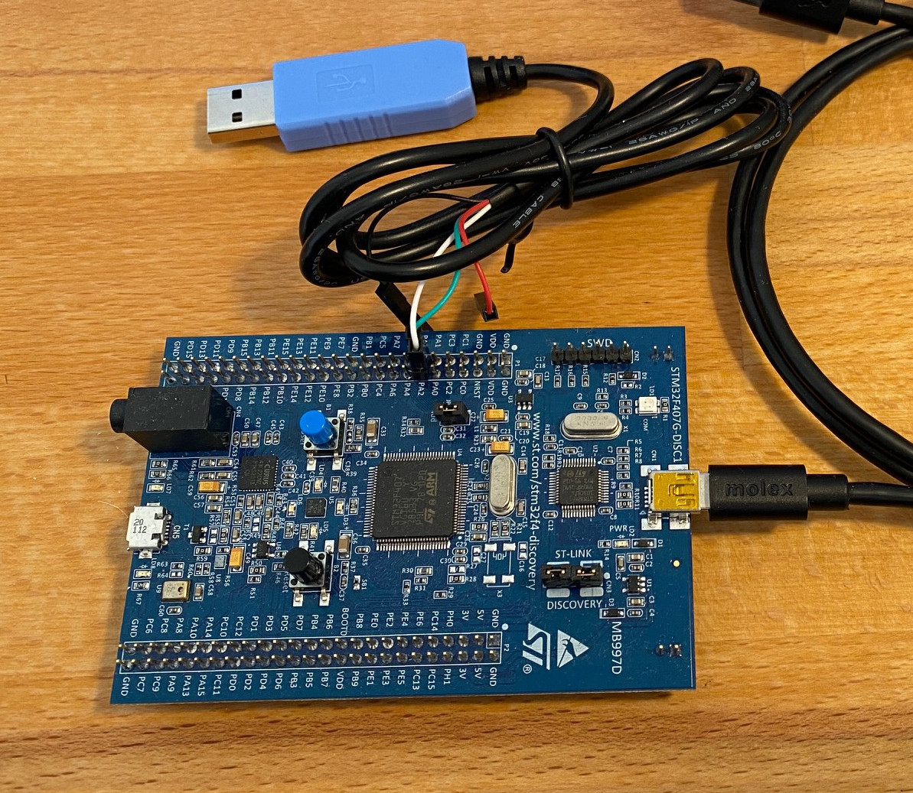
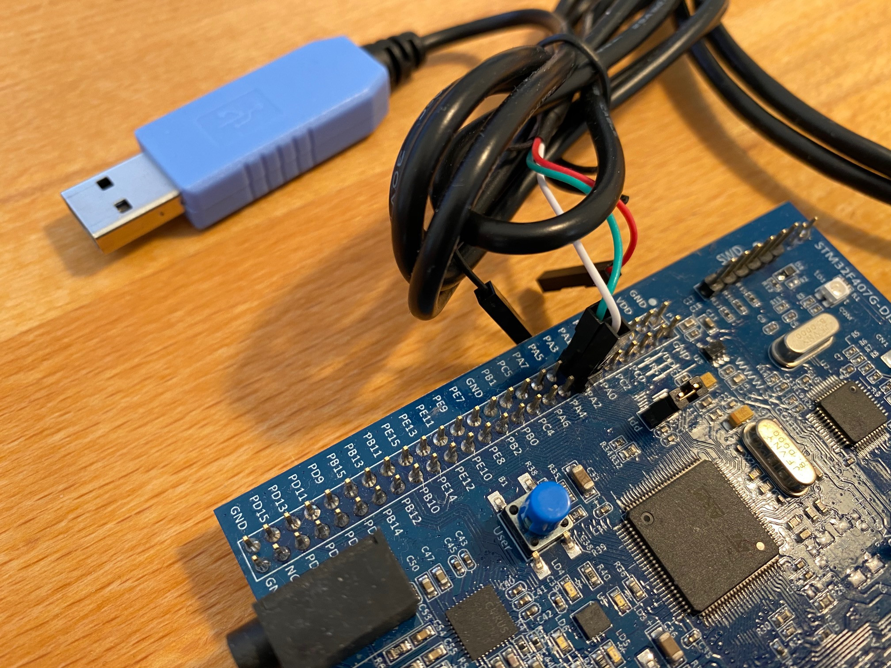

## Compiling

### Target 'unix':

  ```bash
  make TARGET=unix
  ```
  
  Communication via serial (pts); the binary echoes the device and waits for key
  press before computation begins.


### Target 'sim':

  ```bash
  make TARGET=sim
  ```

  **Run with qemu:**

  ```bash
  qemu-system-arm -M lm3s6965evb -nographic -s -S -kernel build/demo.elf -serial pty
  ```

  The '-s' flags enables gdb access; the '-S' makes the program wait in the
  beginning (start with 'c' and Enter); the '-serial' maps IO to serial (pts),
  qemu echoes the device.

  **Debug:**

  ```bash
  arm-none-eabi-gdb -ex "target remote :1234" FILE.elf
  ```

  **Complete test run:**

  In one console, run:

  ```bash
  make TARGET=sim
  qemu-system-arm -M lm3s6965evb -nographic -s -S -kernel build/demo.elf -serial pty
  ```

  Now, ```quemu``` has started, opened a debug port for ```gdb``` (due to the '-s' flag), mapped serial IO to a prs device (e.g., ```/dev/pts/2``` - as reported by ```quemu```), and paused (due to the '-S' flag).

  You should see somethng like the following output:

  ```bash
  QEMU 6.2.0 monitor - type 'help' for more information
  (qemu) char device redirected to /dev/pts/2 (label serial0)
  Timer with period zero, disabling
  ```

  In an other console, start the host Python program to receive serial IO:

  ```bash
  ./demo.py [SERIAL DEVICE]
  ```

  For the '[SERIAL DECVICE]' use the same device as reported by ```quemu```, e.g., '/dev/pts/2' in the example output above.

  Once the host program is started, switch back to ```quemu``` and type 'c' followed by the Enter key. This makes ```quemu``` continue the computation.

  To debug the code during similation, start ```quemu``` again as described aove.
  
  Then, start ```gdb``` in a third console:

  ```bash
  arm-none-eabi-gdb -ex "target remote :1234" build/demo.elf
  ```

  (You might need to use ```gdb-multiarch``` instead depending on your Linux distribution.)

  You can use ```gdb``` as usually to controll the execution, step through the program, print variables, etc. Once you started ```gdb```, enter the command 'contonue' and hit Enter; you sould see the output in the host program.

  Eventually, you can quit ```quemu``` by typing 'q' and Enter.


### Target 'stm32f4':

  ```bash
  make TARGET=stm32f4 demo.bin
  ```

  Program the device with st-flash:

  ```bash
  st-flash write build/demo.bin 0x8000000
  ```

  Use a serial cable for the connection to the host via PA2 and PA3.

  You should be able to see the serial output again using ```demo.py```. The serial device is probably '/dev/ttyUSB0' in this case (see section 'Setup' below).

  **Debug:**

  In one console start ```st-util``` and check which debugging port is opened, by default 4242.

  In another colsole, start gdb:

  ```bash
  gdb-multiarch -ex 'set remotetimeout 10' -ex 'target remote :4242' -ex load -ex 'break main' FILE.elf
  ```
  (You might need to use arm-none-eabi-gdb instead of gdb-multiarch.)

## Setup

You can use a USB to serial cable, e.g., Adafruit USB to TTL Serial Cable (Product ID: 954), for IO with the board.

The cable should show up as device /dev/ttyUSB0 on you Linux machine; you can use the Python host script to directly write into and read from that device.

Using the STM32F407 Discovery board and the Adafruit USB to TTL Serial Cable, the setup should look like this:




Connect white to PA2 and green to PA3; the documentation of the Adafruit TTL USB cable states:

> "...red power, black ground, white RX into USB port, and green TX out of the USB port."


## FAQ

- Running `demo.py` gives the error

  ```bash
  $ ./demo.py /dev/ttyUSB0 
  
  Traceback (most recent call last):
  
    File "demo.py", line 2, in <module>
  
      import serial   # pySerial
  
  ModuleNotFoundError: No module named 'serial'
  ```

  -> Install the Python module pySerial:

  ``pip install pySerial``

- Running `demo.py` gives the error

  ```bash
  $ ./demo.py /dev/ttyUSB0 
  Traceback (most recent call last):
    File "serialposix.py", line 322, in open
      self.fd = os.open(self.portstr, os.O_RDWR | os.O_NOCTTY | os.O_NONBLOCK)
  PermissionError: [Errno 13] Permission denied: '/dev/ttyUSB0'
  
  During handling of the above exception, another exception occurred:
  
  Traceback (most recent call last):
    File "demo.py", line 9, in <module>
      dev = serial.Serial(sys.argv[1], 115200)
    File "serialutil.py", line 244, in __init__
      self.open()
    File "serialposix.py", line 325, in open
      raise SerialException(msg.errno, "could not open port {}: {}".format(self._port, msg))
  serial.serialutil.SerialException: [Errno 13] could not open port /dev/ttyUSB0: [Errno 13] Permission denied: '/dev/ttyUSB0'
  ```

  -> Give your account permissions to access `/dev/ttyUSB0`, e.g., add your account to the group `dialout`.

